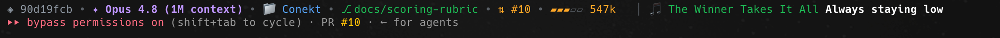

# 🎵 claude-code-spotify

A [Claude Code](https://claude.com/claude-code) statusline that shows your
session at a glance **and** the live, synced lyric of whatever's playing on
Spotify — Spotify-green themed, updating with the music. Ships with `spot`, a
tiny terminal remote for Spotify.



```
◈ 90d19fcb · ✦ Opus 4.8 (1M context) · 📁 Conekt · ⎇ docs/scoring-rubric · ⇅ #10 · ▰▰▰▱▱ 547k   │  🎵 The Winner Takes It All  Always staying low
```

Left to right: **session · model · folder · git branch · PR · context-usage bar · now-playing lyric**. Fields with no data (no branch, no PR, nothing playing) simply drop out.

> **macOS only.** Playback control uses AppleScript against the Spotify **desktop app** (installed + running). Lyrics come from [lrclib.net](https://lrclib.net) — free, no key. Python 3 stdlib only, no pip installs.

---

## Install

Inside Claude Code:

```
/plugin marketplace add RaazKetan/claude-code-spotify
/plugin install spotify-statusline
```

Or just **ask Claude**: *"add the RaazKetan/claude-code-spotify plugin"* — it runs those commands for you. Restart Claude Code and the statusline activates itself: a bundled hook safely points your `settings.json` at the plugin's `statusline.py` — idempotent, preserves your other settings, self-heals on update.

To turn it off: `/plugin uninstall spotify-statusline` and remove the `statusLine` key from `~/.claude/settings.json`.

## `spot` — terminal remote

`spot` ships alongside the statusline in the plugin directory. To use it in your
shell, alias it there — e.g. `alias spot="$HOME/.claude/plugins/marketplaces/spotify-statusline/spot"`.

```bash
spot                 # now playing
spot play / pause / stop
spot next / prev
spot vol 50          # volume 0–100
spot search <song>   # search + play the top match
spot lyrics          # full-screen fading synced lyrics (Ctrl-C to exit)
```

### Search (optional, needs a free Spotify app)

Only `spot search` / auto-play use the Spotify Web API — playback and lyrics don't.

1. <https://developer.spotify.com/dashboard> → **Create app** (any name/redirect).
2. Drop the creds in `~/.claude/.spotify-creds` (chmod 600):
   ```
   SPOTIFY_ID=your_client_id
   SPOTIFY_SECRET=your_client_secret
   ```

Uses the app-only **Client Credentials** flow (no browser login), finds the top match, plays it through the desktop app.

## How it works

- **Playback** — one batched `osascript` (AppleScript) call to the Spotify app.
- **Lyrics** — pulled from lrclib, cached per track in `/tmp/spot-lrc/`. The statusline **never blocks on the network**: on a cache miss it shows the track name and fetches in a detached background process that fills the cache for the next tick. Each render stays well under the 1-second refresh window (~0.2s), so Claude Code never cancels it mid-draw.
- **Statusline fields** — session/model/context/PR come straight from the JSON Claude Code pipes to the command; the git branch is a local `git` call.
- **Context bar** — `▰▰▰▱▱` fills with context-window usage and shifts green → orange → red as you approach the limit.

## Notes / limits

- The vertical "karaoke" fade is in `spot lyrics` (full screen). The statusline is one line, so it shows just the current lyric.
- lrclib rate-limits rapid requests — one fetch per track (normal use) is fine.
- Not every track has synced lyrics; those fall back to `🎵 Artist – Song`.

## License

[MIT](LICENSE.md) © Ketan Raj
